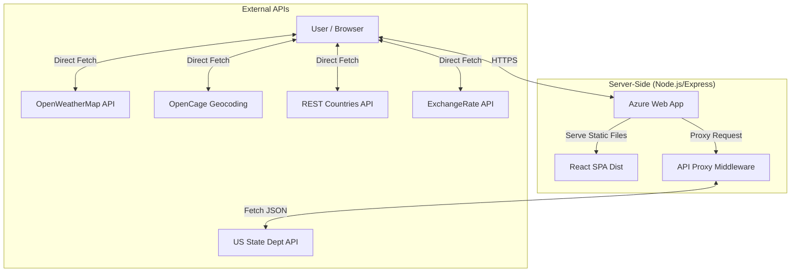

# Global Travel Intelligence Dashboard

A comprehensive web-based application designed to provide travelers with real-time, consolidated information about any destination worldwide. By integrating data from multiple heterogeneous sources (weather, safety, currency, etc.), the system offers a unified interface for travel planning and safety assessment.

.png)
.png)

## 📋 Table of Contents

- [Introduction](#-introduction)
- [Objectives](#-objectives)
- [Features](#-features)
- [System Architecture](#-system-architecture)
- [Public APIs Used](#-public-apis-used)
- [Tech Stack](#-tech-stack)
- [Setup & Installation](#-setup--installation)
- [Deployment](#-deployment)
- [Security](#-security)

---

## 🚀 Introduction

In the modern era of globalization, analyzing a travel destination typically involves checking weather forecasts, safety advisories, exchange rates, and tourist attractions across disparate platforms. This fragmentation leads to information overload and inefficient planning.

**Global Travel Intelligence Dashboard** addresses this by aggregating critical travel data into a single, intuitive dashboard, empowering users to make informed decisions quickly.

---

## 🎯 Objectives

- **Consolidated Data:** Aggregate weather, safety, currency, and tourism data in one view.
- **Real-Time Accuracy:** Fetch live data from trusted third-party APIs.
- **Secure Integration:** Implement a secure reverse proxy to handle restricted external APIs (e.g., US State Department).
- **User-Friendly UI:** Provide a responsive, card-based interface with dynamic theme switching.

---

## ✨ Features

- **Location Search:** Auto-geocoding of city names to coordinates.
- **Travel Advisories:** Real-time safety ratings (Level 1-4) sourced directly from the US Department of State.
- **Live Weather:** Current conditions and 5-day forecasts.
- **Currency Exchange:** Instant conversion rates for the local currency against USD.
- **Tourist Attractions:** Map-based discovery of nearby points of interest.
- **Hotel Recommendations:** dynamic listing of top-rated accommodations.
- **Dark/Light Mode:** Full theming support.

---

## 🏗 System Architecture

The system follows a modern client-server architecture:

- **Frontend:** React-based Single Page Application (SPA).
- **Backend:** Lightweight Node.js/Express server acting as a static file host and API reverse proxy.

### High-Level Diagram



---

## 🔌 Public APIs Used

| API Service | Purpose | Data Points |
| :--- | :--- | :--- |
| **OpenCage Geocoding** | Location Search | Coordinates (Lat/Lng), ISO Country Codes |
| **OpenWeatherMap** | Weather Data | Temp, Humidity, Wind, 5-Day Forecast |
| **US State Dept (CADATA)** | Safety Advisories | Warning Levels (1-4), Advisory Text |
| **REST Countries** | Country Info | Population, Capital, Languages, Timezone |
| **ExchangeRate-API** | Currency | Live Exchange Rates (USD base) |
| **OpenStreetMap** | Attractions | Tourist spots, Museums, Parks |
| **Booking.com** | Hotels | Accommodation listings, Ratings, Prices |

---

## 💻 Tech Stack

### Client-Side
- **Framework:** React.js (v18)
- **Build Tool:** Vite
- **Styling:** Tailwind CSS
- **Icons:** Lucide React

### Server-Side
- **Runtime:** Node.js (v24)
- **Framework:** Express.js
- **Middleware:** http-proxy-middleware (for CORS handling)
- **Hosting:** Azure Web App (Linux)

---

## 🛠 Setup & Installation

### Prerequisites
- Node.js (v18 or higher)
- npm or yarn

### Local Development

1.  **Clone the repository:**
    ```bash
    git clone https://github.com/your-username/global-travel-intelligence.git
    cd global-travel-intelligence
    ```

2.  **Install dependencies:**
    ```bash
    npm install
    # or
    yarn install
    ```

3.  **Configure Environment Variables:**
    Create a `.env` file in the root directory (refer to `.env.example` if available) and add your API keys:
    ```env
    VITE_OPENCAGE_API_KEY=your_key
    VITE_OPENWEATHER_API_KEY=your_key
    # ... add other keys as used in App.jsx
    ```
    *(Note: For this specific project structure, keys are currently hardcoded in `App.jsx` for demonstration purposes, but `.env` is recommended for production).*

4.  **Start the development server:**
    ```bash
    npm run dev
    ```
    Access the app at `http://localhost:5173`.

### Production Mode (Local)

To simulate the production environment (Node.js server + built assets):

1.  **Build the project:**
    ```bash
    npm run build
    ```
    This creates the `dist` folder.

2.  **Start the production server:**
    ```bash
    node server.js
    ```
    Access the app at `http://localhost:8080`.

---

## ☁ Deployment

This project is configured for **Azure Web App (Linux/Node.js)** using Zip Deployment.

### Steps to Deploy

1.  **Prepare the Zip:**
    Select the following files/folders:
    - `src`, `public`
    - `package.json`, `package-lock.json`
    - `server.js`, `vite.config.js`
    - `index.html`, `tailwind.config.js`, `postcss.config.js`
    
    > **CRITICAL:** Do NOT include `node_modules` or `dist`. Azure will build these for you.

2.  **Deploy via Azure CLI:**
    ```powershell
    az webapp deployment source config-zip --resource-group <YourRG> --name <YourWebApp> --src deployment.zip
    ```

3.  **App Configuration:**
    Ensure required App Settings are set in Azure Portal:
    - `SCM_DO_BUILD_DURING_DEPLOYMENT = true`
    - `PORT = 8080` (or let Azure default handle it)
    - `VITE_EXCHANGE_API_KEY = <API Key>` (Add the rest of the required API keys in the App settings)

---

## 🔒 Security

- **API Proxy:** Critical internal routing via `server.js` hides the origin when communicating with strict government APIs.
- **HTTPS Enforcement:** Azure ensures all data in transit is encrypted.
- **Environment Isolation:** Sensitive configurations are managed via environment variables in the cloud environment.

---

## 📄 License

This project is for educational purposes as part of the Service Oriented Computing (IT41073) module.

---

## Team Members
**Student Name:** P.V. Benjamin
**ID:** ITBNM-2211-0001

**Student Name:** Sahan Rodrigo
**ID:** ITBIN-2211-0044

**Student Name:** Nadeesha Perera
**ID:** ITBIN-2211-0057

**Student Name:** Thashmi Sanjana
**ID:** ITBNM-2211-0008
